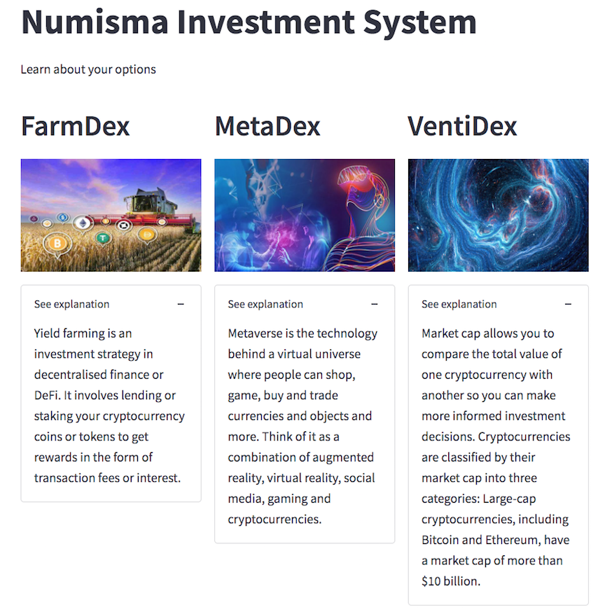
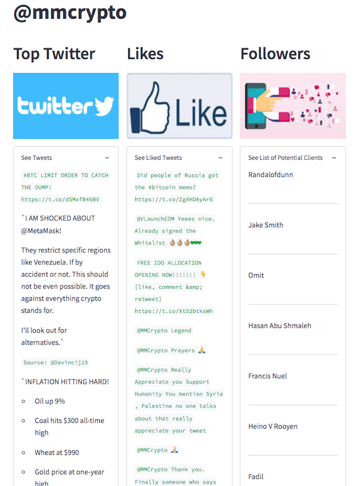

<!-- header is made with: https://github.com/kyechan99/capsule-render -->

[Briggs Lalor](https://www.linkedin.com/in/briggsclalor/) 
[Ken Lee](https://www.linkedin.com/in/kenkwlee) 
[Stephane Maysn](https://www.linkedin.com/in/stephane-masyn-35b16817a/) 
[John Sung](https://linkedin.com/in/john-sung-3675569) 
                                                             

---

### Table of Contents

* [Our Mission](#our-mission)
* [Executive Summary](#executive-summary)
* [Requirements](#requirements)
* [Web Visualization](#visualization)
* [BackEnd](#data)
* [User Experience](#user-experience)
* [Presentation Deck](#Presentation-Deck)
* [License](#license)  

---

## Our Mission

Our mission is to provide the everyday investor with the knowledge and tools to invest in the future without putting all their eggs in one basket.

## Executive Summary

In our attempt to stay true to our mission, we have created a new tool that allows our investors to invest in the crypto market with simplicity, cost reduction and decentralization using solidity contracts under ERC721 standards. 

Our portfolios were designed with weights deriving from the modern portfolio theory. In streamlit, you will be able to assess each of the crypto currencies within each portfolio with its returns over different holding periods. 

In our interactive MVP application, the user can invest in three options. This app will prompt you to select yield farm index [FarmDex], metaverse index [MetDex] or large coin index [VentiDex] using our asset allocation model using the modern portfolio theory. The user can connect to the ganache and purchase the invesment while taking a realtime photo to buy and register the investment on the blackchain.

We also introduced our social media content that shares tweets and likes of the top influencers in the field of crytocurrency. Additionally we can provide a list of followers of these influencers to tarket as future advertizing targets. Please enjoy. 

---

## Requirements

This project leverages python 3.7, streamlit and solidity. The remainder of the requirements can be found in the requirements file.

In order to run this application, you must secure the folowing APIs. You will see the breakdown of the keys and secrets in our sample.env file.

Installation instructions

pip install yfinance --upgrade --no-cache-dir

pip install streamlit-aggrid

pip install tweepy

pip install cufflinks --upgrade

pip install chart_studio

pip install pycoingecko

pip install web3==5.17

pip install eth-tester==0.5.0b3

pip install mnemonic

pip install bip44
 
---

## Web Visualization

## Front end application images

### Learn about the options

### Streamlit Image of MetaDex Portfolio

### Streamlit Image of Social Media

### Portfoilio Demo

### Buy Demo

### Register Demo

### Full Demo

---

## Presentation Deck

##### CLICK to review Presentation Deck:
https://www.canva.com/design/DAE5wI_OonA/zFJJ5TdGuH_ECA2JeHIAFQ/view?utm_content=DAE5wI_OonA&utm_campaign=designshare&utm_medium=link&utm_source=publishsharelink

---
## API Subscription
See Sample.env

## License

Copyright (c) 2022 Briggs Lalor, Ken Lee, Stephane Masyn and John Sung

Permission is hereby granted, free of charge, to any person obtaining a copy
of this software and associated documentation files (the "Software"), to deal
in the Software without restriction, including without limitation the rights
to use, copy, modify, merge, publish, distribute, sublicense, and/or sell
copies of the Software, and to permit persons to whom the Software is
furnished to do so, subject to the following conditions:

The above copyright notice and this permission notice shall be included in all
copies or substantial portions of the Software.

THE SOFTWARE IS PROVIDED "AS IS", WITHOUT WARRANTY OF ANY KIND, EXPRESS OR
IMPLIED, INCLUDING BUT NOT LIMITED TO THE WARRANTIES OF MERCHANTABILITY,
FITNESS FOR A PARTICULAR PURPOSE AND NONINFRINGEMENT. IN NO EVENT SHALL THE
AUTHORS OR COPYRIGHT HOLDERS BE LIABLE FOR ANY CLAIM, DAMAGES OR OTHER
LIABILITY, WHETHER IN AN ACTION OF CONTRACT, TORT OR OTHERWISE, ARISING FROM,
OUT OF OR IN CONNECTION WITH THE SOFTWARE OR THE USE OR OTHER DEALINGS IN THE
SOFTWARE.

---
